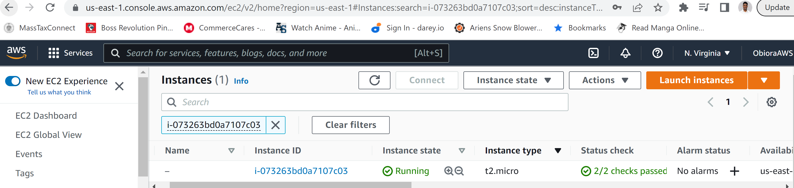

## Documentation of Project-2

Web STACK Implementation (LEMP STACK)

A new EC2 instance of t2.micro with Ubuntu server 22.04 was created on my ASW.amazon.com account

Instance was ssh into 

Installing the Nginx Web Server

 Nginx, a high-performance web server was installed using 

`sudo apt update`
`sudo apt install nginx`

The above output indicated the need for an upgrade, thus

`sudo apt upgrade`

nginx was verified to be successfully installed and running as a service in Ubuntu, by running the command below

`sudo systemctl status nginx`

The image below shows the status of nginx

Because a security group was created in which port 80 was already enabled, a new inbound rule was not neccessary.
Checking to see if server can be accessed from Ubuntu, the command below was ran

`curl http://127.0.0.1:80`

Pubic ip address was pasted on a web browser to check access. IP address could be copied from the connected instance or input the command to retrieve ip 34.201.116.195

`curl -s http://169.254.169.254/latest/meta-data/public-ipv4`

Public ip 34.201.116.195 address was pasted on a web browser

INSTALLING MYSQL

Since an active web server has be established, MySQL will be used as database management system which allows storage and management of data. The 'apt' was used to acquire and install this software.

`sudo apt install mysql-server` 

Note that this gave a long output, thus ending of the output with a confirmation that it was successfully installed was captured.

To log into mySQL console, the command below was used. This connects to the MySQL server as the administrative database root user

`sudo mysql` 

As a recommended a security script that comes pre-installed with MySQL is ran. This script removes some insecure default settings and lock down access to the database system; setting a password, then exit

`ALTER USER 'root'@'localhost' IDENTIFIED WITH mysql_native_password BY 'PassWord.1';`

Start interactive script by running code below

`sudo mysql_secure_installation`

Using the code below, I logged in into mySQL console, I was prompted to enter password "PassWord.1" and was successful. Exited the console by typing command exit

`sudo mysql -p`

Installing PHP

Currently nginx (Server) and mySQL (Store and Manage content) has been successfully installed, PHP will be installed to process code and generate dynamic content for the web server.

`sudo apt install php-fpm php-mysql`

**Configuring Nginx to Use PHP Processor**

Nginx web server, allows  creation of server blocks (similar to virtual hosts in Apache) to encapsulate configuration details and host more than one domain on a single server. projectLEMP is used as an example domain name.

A root web directory for your_domain was created using:

`sudo mkdir /var/www/projectLEMP`

Ownership of directory with $USER environment variables was assigned 

`sudo chown -R $USER:$USER /var/www/projectLEMP`

 A new configuration file in Nginx’s sites-available directory was opened using your preferred command-line editor

`sudo nano /etc/nginx/sites-available/projectLEMP`

This command opens a blank file and the following bare-bone configuration was done and saved

>*Interpretation of the picture above*

>*listen — Defines what port Nginx will listen on. In this case, it will listen on port 80, the default port for HTTP.*

>*root — Defines the document root where the files served by this website are stored.*

>*index — Defines in which order Nginx will prioritize index files for this website. It is a common practice to list index.html files with a higher precedence than index.php files to allow for quickly setting up a maintenance landing page in PHP applications. You can adjust these settings to better suit your application needs.*

>*server_name — Defines which domain names and/or IP addresses this server block should respond for. Point this directive to your server’s domain name or public IP address.*

>*location / — The first location block includes a try_files directive, which checks for the existence of files or directories matching a URI request. If Nginx cannot find the appropriate resource, it will return a 404 error.*

>*location ~ \.php$ — This location block handles the actual PHP processing by pointing Nginx to the fastcgi-php.conf configuration file and the php7.4-fpm.sock file, which declares what socket is associated with php-fpm.*

>*location ~ /\.ht — The last location block deals with .htaccess files, which Nginx does not process. By adding the deny all directive, if any .htaccess files happen to find their way into the document root ,they will not be served to visitors.*

Configuration was activated by linking to the config file from Nginx’s sites-enabled directory. This tells Nginx to use the configuration next time it is reloaded.

`sudo ln -s /etc/nginx/sites-available/projectLEMP /etc/nginx/sites-enabled/`

To check configuration for syntax errors, this command was used

`sudo nginx -t`

Default Nginx host that is currently configured to listen on port 80 was disabled with the command

`sudo unlink /etc/nginx/sites-enabled/default`

Nginx was reloaded to apply changes

`sudo systemctl reload nginx`

New website is now active, but the web root /var/www/projectLEMP is still empty. An index.html file was created in that location so as to test that new server block works as expected

`sudo echo 'Hello LEMP from hostname' $(curl -s http://169.254.169.254/latest/meta-data/public-hostname) 'with public IP' $(curl -s http://169.254.169.254/latest/meta-data/public-ipv4) > /var/www/projectLEMP/index.html`

On a web browser, TCP ip address 34.201.116.195 was typed in and the follwing page was displayed

Your LEMP stack is now fully configured

**Testing PHP with Nginx**

A test PHP file was created in the document root

`sudo nano /var/www/projectLEMP/info.php`

This opens a blank space and valid php code that returns information the the server was typed.

To access the web page, a web browser was opened and http://34.201.116.195/info.php was typed in. Page below displayed

**Retrieving data from MySQL database with PHP**

A database named project-2_database and a user named project-2_user was created. First connect to mySQL console, next database was created, then user name

`sudo mysql -p`

`mysql> CREATE DATABASE `project-2_database`;`

`mysql>  CREATE USER 'project-2_user'@'%' IDENTIFIED WITH mysql_native_password BY 'password';`

User was given permission over the project-2_database database

`mysql> GRANT ALL ON project-2_database.* TO 'project-2_user'@'%';`

Next, Exit 

`mysql> exit`

